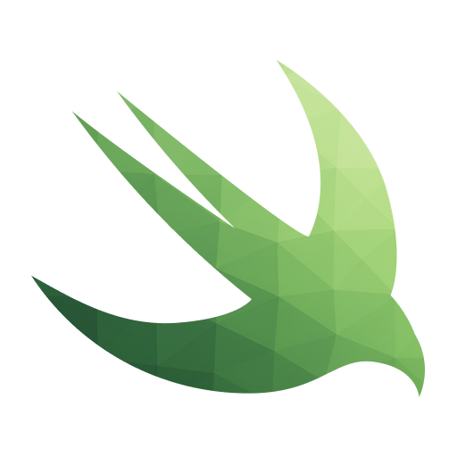

# Bazel BSP

VSCode extension for Bazel-based iOS/macOS development with integrated debugging and BSP support.

<p align="center">
  
</p>

## What It Does

- **Target Management**: Query, select, and build Bazel targets via UI
- **Debugging**: Launch apps with LLDB integration (via [CodeLLDB](https://github.com/vadimcn/codelldb))
- **BSP Integration**: Generate config for [sourcekit-bazel-bsp](https://github.com/spotify/sourcekit-bazel-bsp) to enable Swift language features
- **Device/Simulator Control**: Manage destinations from VSCode
- **Tool Detection**: Check and install required tools (Bazel, Xcode, etc.)

### Demo
[](https://vimeo.com/1133527373)

---

## Installation

### Quick Install

```bash
curl -s https://api.github.com/repos/maatheusgois-dd/bazelbsp/releases/latest | grep "browser_download_url.*vsix" | cut -d '"' -f 4 | xargs -I {} sh -c 'curl -L -o /tmp/bazelbsp.vsix {} && code --install-extension /tmp/bazelbsp.vsix && rm /tmp/bazelbsp.vsix'
```

Or:

```bash
curl -fsSL https://raw.githubusercontent.com/maatheusgois-dd/bazelbsp/main/scripts/install-latest.sh | bash
```

### Manual Install

1. Download `.vsix` from [Releases](https://github.com/maatheusgois-dd/bazelbsp/releases/latest)
2. Open Extensions (`Cmd+Shift+X`)
3. Click `...` → "Install from VSIX..."

---

## Quick Start

1. Open a Bazel workspace in VSCode
2. Click the Bazel BSP icon (🔧) in the Activity Bar
3. Select a target from the Bazel Targets view
4. Select a destination (simulator/device)
5. Press `Cmd+R` to run or `Cmd+Shift+D` to debug


---

## Features

### Bazel Integration
- Query targets in workspace
- Build with configurable modes (Debug, Release, Release+Symbols)
- Run and test targets
- Cache management
- Keyboard shortcuts (`Cmd+R`, `Cmd+B`, `Cmd+U`, `Cmd+K`)

### Debugging
- Full LLDB support via CodeLLDB
- Breakpoints, stepping, variable inspection
- Wait-for-debugger mode
- Custom LLDB commands

### BSP (Code Intelligence)
- Generate `.bsp/skbsp.json` config for [sourcekit-bazel-bsp](https://github.com/spotify/sourcekit-bazel-bsp)
- Auto-prompt to update config when target changes
- Live BSP log monitoring
- Note: Code intelligence is provided by sourcekit-bazel-bsp + Swift extension

### Destinations
- List simulators and physical devices
- Start/stop simulators
- Take screenshots
- Cache management

### Tools
- Detect required tools (Bazel, Xcode, devicectl, simctl, xcbeautify, sourcekit-bazel-bsp)
- One-click installation for missing tools
- Health check diagnostics

### MCP Server
- Exposes extension capabilities to AI assistants
- Port: `61333`
- Tools: build, test, run, query targets, control simulators

---

## Configuration

Key settings:

```json
{
  "bazelbsp.bazel.buildMode": "debug",
  "bazelbsp.bazel.queryExcludePaths": ["//path/to/exclude/..."],
  "bazelbsp.bsp.autoUpdateOnTargetChange": true,
  "bazelbsp.build.xcbeautifyEnabled": true,
  "bazelbsp.build.enableIndexingInDebug": true
}
```

See [Configuration Guide](docs/configuration.md) for full details.

---

## Documentation

- [Features](docs/features.md) - Detailed feature descriptions
- [Configuration](docs/configuration.md) - All settings and commands
- [Troubleshooting](docs/troubleshooting.md) - Common issues and solutions
- [Architecture](docs/architecture.md) - Code structure and design
- [Contributing](docs/contributing.md) - Development setup and guidelines
- [Launch Configuration](docs/launch.md) - Debugging setup

---

## Known Issues

- BSP config generation assumes specific format (may need customization)
- Build commands may need project-specific adjustments
- Swift extension installation may trigger both old and new versions
- App logging doesn't work when debugger is attached
- Index reuse during debug builds not fully working

See [TODO.md](TODO.md) for planned improvements.

---

## Requirements

- macOS
- VSCode 1.85.0+
- Node.js 22.x (for development)
- Bazel
- Xcode (for iOS SDK and simulators)

---

## Credits

This extension integrates with:
- [Bazel](https://bazel.build/) - Build system
- [sourcekit-bazel-bsp](https://github.com/spotify/sourcekit-bazel-bsp) - Build Server Protocol implementation
- [CodeLLDB](https://github.com/vadimcn/codelldb) - LLDB debugger integration
- [Swift Extension](https://github.com/swift-server/vscode-swift) - Swift language support
- [Sweetpad](https://github.com/sweetpad-dev/sweetpad) - Inspiration for iOS development in VSCode

---

## License

MIT - see [LICENSE.md](LICENSE.md)

---

## Support

- 📖 [Documentation](docs/)
- 🐛 [Issue Tracker](https://github.com/maatheusgois-dd/bazelbsp/issues)
- 💬 DoorDash Slack: `#ios-tooling`
